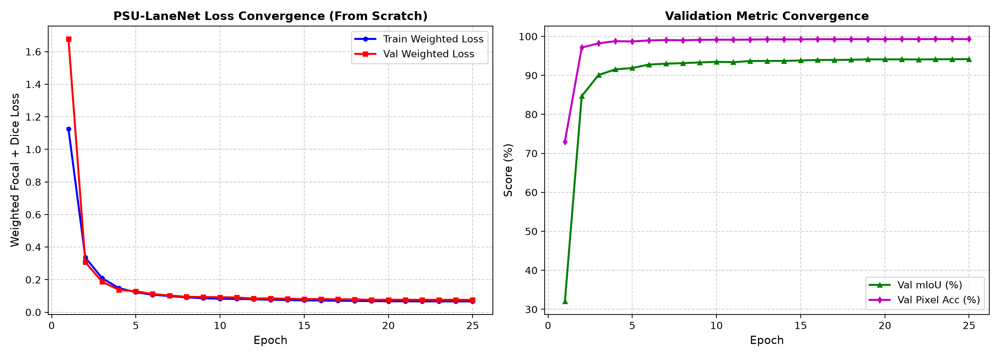
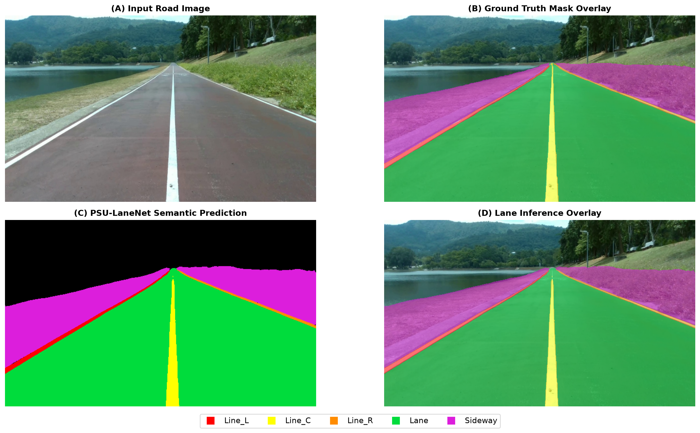
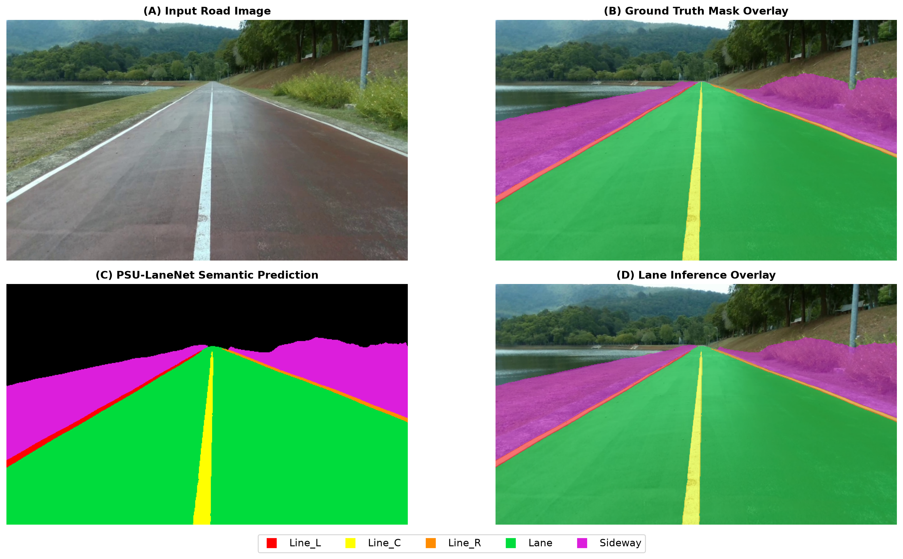
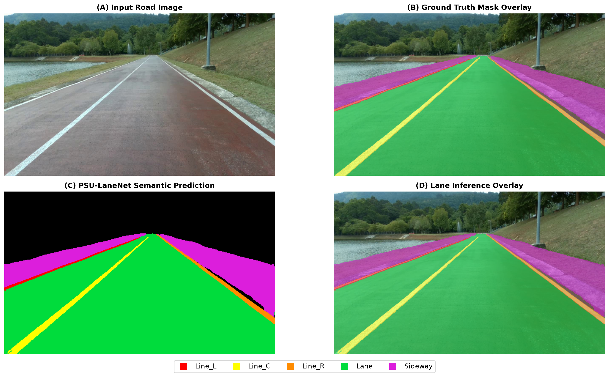
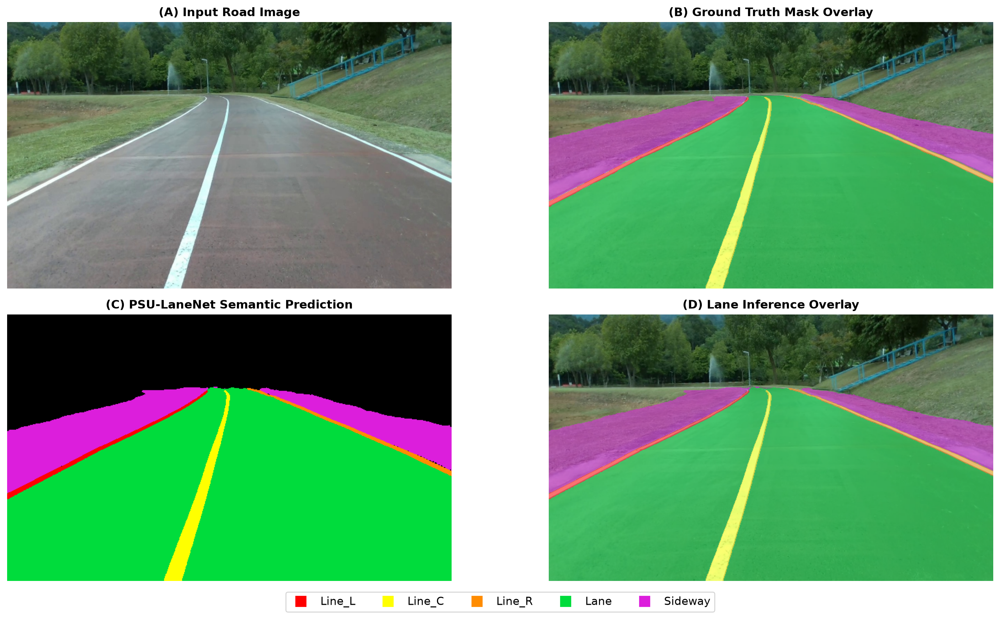
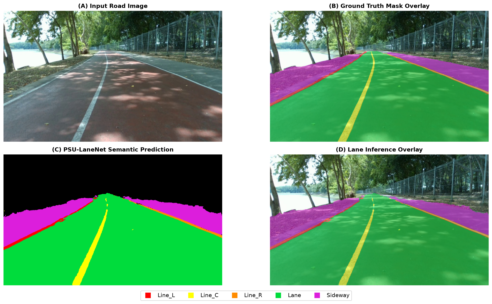

# Assignment 10: Lane Segmentation Neural Network from Scratch
**วิชา:** 241-353 Artificial Intelligence Ecosystem | ภาคการศึกษา 1/2569  
**ผู้จัดทำ:** นายณัฐวุฒิ ถนอมแก้ว (รหัสนักศึกษา: 6710110138)  
**สาขาวิชาวิศวกรรมคอมพิวเตอร์ คณะวิศวกรรมศาสตร์ มหาวิทยาลัยสงขลานครินทร์**

---

## สรุปภาพรวมของงาน
งานนี้เป็นการทำ Lane Segmentation โดยออกแบบสถาปัตยกรรม Neural Network ขึ้นมาเองตั้งแต่เริ่มต้น (Train from scratch 100%) โดยไม่ใช้โมเดล Pre-trained และไม่ใช้ Backbone สำเร็จรูป (เช่น ResNet, MobileNet, YOLO หรือ VGG) 

* **Dataset ที่ใช้:** ข้อมูลภาพและ Polygon Label ของชุดข้อมูล PSU-reservoir dataset จาก Assignment 8 (คัดเฉพาะข้อมูล Polygon แปลงเป็น Mask 6 คลาส ได้แก่ Background, Line_L, Line_C, Line_R, Lane, Sideway โดยไม่ใช้ Bounding box และ Polylines)
* **การจำกัดทรัพยากร:** ออกแบบโมเดลให้มีขนาดเล็กและกิน Memory ต่ำ เพื่อให้สามารถเทรนและรัน Inference บนคอมพิวเตอร์ทั่วไป (Laptop/PC) ได้อย่างลื่นไหลแบบ Real-time

---

## 1. การอธิบายโครงสร้าง Neural Network ที่ออกแบบเอง พร้อมเหตุผลประกอบ

โมเดลที่ผมออกแบบมีชื่อว่า **PSU-LaneNet** (หรือ `ResLaneSegNet`) ใช้โครงสร้างพื้นฐานแบบ **Encoder-Decoder (U-Net style)** ผสมกับ **Depthwise Separable Convolution**, **Strip Context Module** และ **Channel Attention**

### ไดอะแกรมโครงสร้างโมเดล

```text
[Input Image: 3 x 384 x 640]
         │
         ▼
┌───────────────────────────┐
│ ConvStem (Stride=2)       │ ──┐ (Skip 0: 32ch, 192x320)
│ [32 x 192 x 320]          │   │
└─────────────┬─────────────┘   │
              ▼                 │
┌───────────────────────────┐   │
│ Encoder 1 (DS-Conv)       │ ──┼──┐ (Skip 1: 48ch, 96x160)
│ [48 x 96 x 160]           │   │  │
└─────────────┬─────────────┘   │  │
              ▼                 │  │
┌───────────────────────────┐   │  │
│ Encoder 2 (DS-Conv)       │ ──┼──┼──┐ (Skip 2: 96ch, 48x80)
│ [96 x 48 x 80]            │   │  │  │
└─────────────┬─────────────┘   │  │  │
              ▼                 │  │  │
┌───────────────────────────┐   │  │  │
│ Encoder 3 (DS-Conv)       │   │  │  │
│ [160 x 24 x 40]           │   │  │  │
└─────────────┬─────────────┘   │  │  │
              ▼                 │  │  │
┌───────────────────────────┐   │  │  │
│ Strip Context Module      │   │  │  │
│ (1x7 & 7x1 Convolutions)  │   │  │  │
│ [160 x 24 x 40]           │   │  │  │
└─────────────┬─────────────┘   │  │  │
              ▼                 │  │  │
┌───────────────────────────┐   │  │  │
│ Decoder 3 + Skip 2 + SE   │ ◄─┘  │  │
│ [96 x 48 x 80]            │      │  │
└─────────────┬─────────────┘      │  │
              ▼                    │  │
┌───────────────────────────┐      │  │
│ Decoder 2 + Skip 1 + SE   │ ◄────┘  │
│ [48 x 96 x 160]           │         │
└─────────────┬─────────────┘         │
              ▼                       │
┌───────────────────────────┐         │
│ Decoder 1 + Skip 0 + SE   │ ◄───────┘
│ [32 x 192 x 320]          │
└─────────────┬─────────────┘
              ▼
┌───────────────────────────┐
│ Segmentation Head (2x)    │
│ [6 x 384 x 640]           │
└───────────────────────────┘
```

### เหตุผลในการออกแบบแต่ละส่วน:
1. **ConvStem ย่อภาพลง 2 เท่าตั้งแต่ชั้นแรก:**  
   ภาพกล้องหน้ารถมีขนาดใหญ่ การนำภาพเข้า Conv มาตรฐานทันทีจะทำให้ Feature Map ขนาดใหญ่กิน VRAM มหาศาล Stem เลเยอร์แรกจึงลดขนาดลงครึ่งหนึ่ง ($384\times 640 \to 192\times 320$) ช่วยประหยัด Memory ได้ถึง 75% ตั้งแต่จุดเริ่มต้น
2. **ใช้ Depthwise Separable Convolution แทน Standard Conv:**  
   เพื่อลดการคำนวณและจำนวน Parameter การแยก Spatial Conv (3x3) ออกจาก Channel Conv (1x1) ช่วยลดขนาดโมเดลลงได้ประมาณ 8-9 เท่า ทำให้โมเดลมีพารามิเตอร์รวมเพียง **3.77 แสนตัว (~0.38M)** และไฟล์น้ำหนักโมเดลมีขนาดเพียง **4.45 MB**
3. **Strip Context Module ที่ Bottleneck (เคอร์เนล 1x7 และ 7x1):**  
   เส้นเลนบนถนนมีลักษณะทางกายภาพเป็นแนวยาวต่อเนื่องในแนวตั้งและมุมมอง Perspective ลู่เข้าสู่ขอบฟ้า การใช้เคอร์เนลสี่เหลี่ยมปกติ (3x3) อย่างเดียวจะมองเห็นขอบเขตได้จำกัด แต่ถ้าใช้เคอร์เนลทรงยาว (Strip Conv) จะช่วยให้โมเดลจับความต่อเนื่องของเส้นเลนยาวๆ ได้ดีขึ้นมาก โดยไม่เปลืองหน่วยความจำ
4. **Skip Connections แบบ U-Net:**  
   เส้นแบ่งเลน (`Line_L`, `Line_C`, `Line_R`) เป็นเส้นที่แคบมาก (หนาเพียงไม่กี่พิกเซล) ถ้าผ่านการย่อขนาด (Downsampling) หลายชั้น ข้อมูลเชิงตำแหน่งจะหายไป การดึง Feature ความละเอียดสูงจากฝั่ง Encoder ข้ามมาต่อกับ Decoder โดยตรง ทำให้ต่อขอบเส้นเลนคืนรูปได้แม่นยำ คมชัด ไม่ขาดตอน
5. **Channel Attention (Squeeze-and-Excitation):**  
   ใส่ไว้ใน Decoder แต่ละชั้น เพื่อให้โมเดลเลือกโฟกัสเฉพาะ Channel ที่เป็นผิวถนนและเส้นเลน และตัดสัญญาณรบกวนจากผิวน้ำในอ่างเก็บน้ำหรือเงาต้นไม้ข้างทางออกไป

---

## 2. กราฟของ Loss ที่แสดงการลู่เข้าของโมเดลที่ผ่านการเทรน

ผมเทรนโมเดลทั้งหมด 25 Epochs โดยใช้ **Weighted Focal Loss + Multi-Class Dice Loss** ที่เพิ่มค่าน้ำหนัก Loss ให้กับเส้นแบ่งเลนบางๆ เพื่อแก้ปัญหา Class Imbalance:
* Optimizer: **AdamW** (Weight decay = 1e-4)
* Learning Rate: เริ่มที่ **0.001** และลดลงแบบ **Cosine Annealing** จนถึง 1.4e-5
* Input Resolution: **$384 \times 640$ พิกเซล**
* สัดส่วนชุดข้อมูล: Train 80% (266 ภาพ), Val/Test 20% (67 ภาพ)



### ผลการสังเกตจากกราฟ:
* **Training Loss:** ค่า Weighted Loss ลดลงอย่างรวดเร็วและต่อเนื่อง จาก ~0.50 ในช่วง Epoch แรกๆ ลงมาเหลือเพียง **0.0662** ใน Epoch ที่ 25
* **Validation Loss & Accuracy:** ค่า Loss ฝั่ง Validation ลดลงสอดคล้องกับฝั่ง Train และนิ่งอยู่ที่ **0.0758** โดยค่า Validation Pixel Accuracy ทรงตัวอยู่ในระดับสูงถึง **99.31%** และค่า Validation mIoU ไต่ขึ้นมาแตะระดับ **94.16%** ได้อย่างมั่นคง ไม่มีปัญหา Overfitting

---

## 3. ค่าการวัดผลประสิทธิภาพของโมเดล

ทดสอบโมเดลกับชุดข้อมูลทดสอบ **Test Set จำนวน 67 ภาพ** (ภาพที่แยกออกมาและโมเดลไม่เคยเห็นในขั้นตอน Training) ได้ค่าการวัดผลจริงดังนี้:

| Class ID | Class Name | รายละเอียดคลาส | IoU (%) | Dice / F1 (%) |
| :---: | :--- | :--- | :---: | :---: |
| `0` | **Background** | สภาพแวดล้อมนอกถนน (ท้องฟ้า, ภูเขา, ผิวน้ำ) | **98.73%** | **99.36%** |
| `1` | **Line_L** | เส้นแบ่งเลนขอบซ้าย (สีแดง) | **89.84%** | **94.65%** |
| `2` | **Line_C** | เส้นแบ่งเลนกึ่งกลาง (สีเหลือง) | **93.39%** | **96.58%** |
| `3` | **Line_R** | เส้นแบ่งเลนขอบขวา (สีส้ม) | **86.97%** | **93.03%** |
| `4` | **Lane** | ผิวจราจรเลนขับขี่บนถนน (สีเขียว) | **99.58%** | **99.79%** |
| `5` | **Sideway** | ทางเท้า / ไหล่ทางเลียบอ่างเก็บน้ำ (สีม่วง) | **96.44%** | **98.19%** |

### ค่าเฉลี่ยรวม (Overall Metrics):
* **Mean IoU (mIoU):** **94.16%**
* **Mean Dice (mF1):** **96.93%**
* **Pixel Accuracy:** **99.31%**

**ข้อสังเกต:**  
* ผิวทางวิ่งขับขี่ (`Lane`) มีความแม่นยำสูงมากถึง **99.58% IoU** และ **99.79% Dice**
* เส้นแบ่งเลนตรงกลาง (`Line_C`) และเส้นขอบทางทั้งสองฝั่ง (`Line_L`, `Line_R`) ได้คะแนน Dice สูงเกิน **93% - 96%** ทุกคลาส แม้จะเป็นเส้นที่แคบเพียงไม่กี่พิกเซลบนภาพขนาด 640x384
* ขอบทางเท้า (`Sideway`) ได้รับคะแนนสูงถึง **96.44% IoU** แสดงว่าโมเดลแยกความแตกต่างระหว่างพื้นหญ้า/ทางเท้ากับผิวถนนได้เด็ดขาด

---

## 4. ตัวอย่างภาพ (Snapshot) ก่อน/หลัง การ Inference

ตัวอย่างผลลัพธ์การรันบน Test Set แสดงผลแบบ 4 ช่อง (2x2 Grid) ครบถ้วนตามมาตรฐานการตรวจสอบ Semantic Segmentation:
* **(A) Input Road Image:** ภาพต้นฉบับความละเอียดสูงจากกล้องหน้ารถ
* **(B) Ground Truth Mask Overlay:** มาร์กเกอร์ Polygon ดั้งเดิมจาก Dataset
* **(C) PSU-LaneNet Semantic Prediction:** แผนที่ Mask สี 6 Classes ที่โมเดลทำนายบนพื้นหลังสีดำ
* **(D) Lane Inference Overlay:** ภาพแสดงผลการฉาย Mask โปร่งแสงทับบนถนนจริง

### ภาพตัวอย่างที่ 1: ช่วงถนนตรงและขอบทางเลียบอ่างเก็บน้ำ (Frame 00003)


### ภาพตัวอย่างที่ 2: ทางตรงทอดยาวพร้อมเส้นประแบ่งเลนกลางชัดเจน (Frame 00092)


### ภาพตัวอย่างที่ 3: ช่วงถนนเริ่มมีแนวโค้งซ้าย (Frame 00168)


### ภาพตัวอย่างที่ 4: ช่วงทางโค้งต่อเนื่องพร้อมแนวขอบทางลาดเอียง (Frame 00227)


### ภาพตัวอย่างที่ 5: ช่วงปลายทางตรงเลียบแนวต้นไม้ (Frame 00328)


---

## 5. ขนาด Memory Footprint ที่ใช้ในการ Inference

วัดผลบนเครื่อง Laptop (NVIDIA GeForce RTX 3050 Laptop GPU / Windows 11):

| หัวข้อที่วัดผล | ค่าที่วัดได้จริง |
| :--- | :---: |
| **ขนาดไฟล์โมเดล (`best_model.pth`)** | **4.45 MB** |
| **จำนวน Parameter ทั้งหมด** | **377,004 ตัว (~0.38M)** |
| **ขนาดภาพ Input** | **640 x 384 พิกเซล** |
| **GPU VRAM สูงสุดตอน Inference (Peak VRAM)** | **89.48 MB** (ใช้ไม่ถึง 100 MB!) |
| **RAM เครื่องที่ใช้งาน (System RAM)** | **898.01 MB** |
| **เวลาในการ Inference ต่อภาพ (Latency)** | **9.15 ms/frame** |
| **ความเร็วในการประมวลผล (Throughput)** | **109.2 FPS** |

**สรุปเรื่อง Memory:**  
โมเดลมีขนาดกะทัดรัดมาก มี Parameter เพียง 3.77 แสนตัว กิน VRAM ตอนรันเพียง **89.48 MB** และกิน RAM เครื่องไม่ถึง 1 GB ขณะที่ความเร็วในการประมวลผลสูงถึง **109.2 FPS** จึงสามารถนำไปติดตั้งบนอุปกรณ์พกพา หรือระบบ ADAS ประมวลผลแบบ Real-time ได้อย่างมีประสิทธิภาพ

---

## โครงสร้างโฟลเดอร์ของโปรเจกต์

```text
Assignment-10/
├── checkpoints/
│   ├── best_model.pth           # Weight โมเดลที่ดีที่สุด (Val mIoU 94.16%)
│   └── latest_model.pth         # Weight โมเดล Epoch สุดท้าย
├── data/
│   ├── __init__.py
│   └── dataset.py               # Dataset class แปลง Polygon เป็น Mask 6 คลาส
├── dataset/                     # ข้อมูลภาพและ Polygon Label (Train / Val / Test)
│   ├── images/
│   └── labels/
├── models/
│   ├── __init__.py
│   └── custom_lane_net.py       # โค้ดโมเดล PSU-LaneNet (ResLaneSegNet)
├── snapshots/                   # ภาพผลลัพธ์เปรียบเทียบ 4 ช่อง (2x2 Grid)
│   ├── snapshot_1_frame_00003.png
│   ├── snapshot_2_frame_00092.png
│   ├── snapshot_3_frame_00168.png
│   ├── snapshot_4_frame_00227.png
│   └── snapshot_5_frame_00328.png
├── utils/
│   ├── __init__.py
│   ├── losses.py                # Weighted Focal + Dice Loss
│   └── metrics.py               # ตัวคำนวณ IoU, Dice และ Pixel Accuracy
├── evaluate.py                  # สคริปต์รันประเมินผลบน Test Set
├── measure_memory.py            # สคริปต์วัด Memory และความเร็ว
├── predict.py                   # สคริปต์สร้างรูป Snapshots แบบ 4 Panel
├── train.py                     # สคริปต์สำหรับเทรนโมเดล
├── loss_convergence.png         # กราฟ Loss Convergence
├── evaluation_results_test.json # ข้อมูลคะแนนแบบ JSON
├── memory_footprint.json        # ข้อมูล Memory แบบ JSON
├── requirements.txt             # รายการไลบรารีที่จำเป็น
├── .gitignore                   # ไฟล์ยกเว้นขยะของ Git
└── README.md                    # เอกสารรายงาน
```

---

## วิธีการรันโค้ด

1. **สั่งเทรนโมเดลใหม่จากศูนย์:**
   ```bash
   python train.py
   ```
   *(หรือระบุค่าเพิ่ม: `python train.py --epochs 25 --batch_size 8`)*

2. **รันประเมินผลบน Test Set:**
   ```bash
   python evaluate.py
   ```
   *(หรือระบุชุดข้อมูล: `python evaluate.py --split test`)*

3. **สร้างภาพผลลัพธ์ Snapshots 4-Panel:**
   ```bash
   python predict.py
   ```

4. **วัด Memory Footprint และ FPS:**
   ```bash
   python measure_memory.py
   ```
